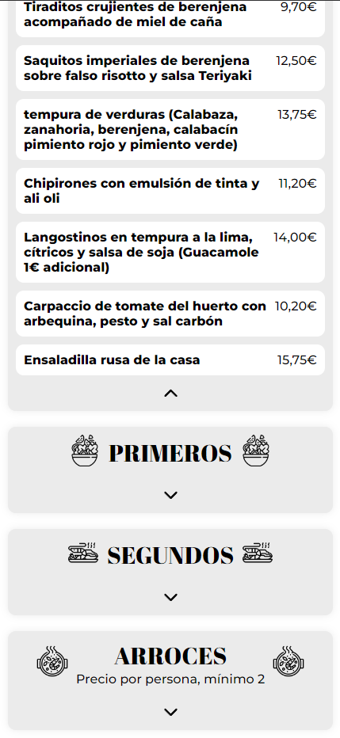

# SUNSET - Carta web


## Tabla de contenidos

-   [Descripción del proyecto y objetivo](#descripción-del-proyecto-y-objetivo)
-   [Capturas de pantalla](#capturas-de-pantalla)
-   [Características](#características)
-   [Tecnologías](#tecnologías)
-   [Despliegue](#despliegue)
-   [Instrucciones de uso](#instrucciones-de-uso)
-   [Variables de entorno](#variables-de-entorno)
-   [Estructura del proyecto](#estructura-del-proyecto)
-   [Contribución](#contribución)
-   [Licencia](#licencia)
-   [Contacto](#contacto)
-   [Agradecimientos](#agradecimientos)

## Descripción del Proyecto y Objetivo

Este proyecto consiste en el desarrollo de la carta web de [SUNSET](https://www.sunsetlacala.es/), un restaurante ubicado en la Cala de Finestrat,
Alicante, España. Se trata de un trabajo freelance cuyo objetivo es proporcionar a los clientes una versión digital del menú del restaurante, en
diversos idiomas, incluyendo precios, fotos y explicaciones de los mismos. Además se proporciona información de la ubicación, redes sociales y fotos
del local.

## Capturas de pantalla

<p align="center">
    
    
</p>

## Características

-   Diseño web moderno y responsivo, adaptado a todas las resoluciones de pantalla.
-   Presentación visual del contenido mediante la implementación de un carrusel desarrollado de manera nativa.
-   Implementación de elementos de diseño como íconos con la librería de [react-icons](https://react-icons.github.io/react-icons/).
-   Utilización de la librería [react-google-maps](https://visgl.github.io/react-google-maps/) para renderizar un componente con un mapa interactivo,
    donde se muestra la ubicación del local.
-   Navegación entre las diferentes vistas mediante el uso de la librería [react-router-dom](https://reactrouter.com/en/main).
-   Creción de un código qr que enlaca con la web, el cual estará en las mesas del restaurante, implementando el servicio de
    [QR Code Generator](https://es.qr-code-generator.com/).
-   Selector de idiomas mediante la implementación de la librería [react-i18next](https://www.npmjs.com/package/react-i18next).
-   Implementación de variables de entorno, con el objetivo de mantener la privacidad y seguridad del usuario y ocultar información sensible.

## Tecnologías

-    **Vite:** Se utilizó como generador de proyeto y entorno de desarrollo.
-    **React:** Se utilizó como freamwork de desarrollo del cliente.
-    **Npm:** Se utilizó para la incorporación de todas las librerías utilizadas en el proyecto.
-    **Vercel:** Se utilizó para el despligue de la aplicación.

## Despliegue

Este proyecto ha sido desplegado en mediante el servicio gratuito de [Vercel](https://vercel.com/).

## Instrucciones de uso

Para correr este servicio de manera local deberá seguir los siguientes pasos:

1. Clone este repositorio en tu máquina local con el comando:
    ```bash
    git clone https://github.com/Gaston-Valentini/sunset.git
    ```
2. En la carpeta que se generó el proyecto, instale las dependencias con el comando:
    ```bash
    npm install
    ```
3. Cree un archivo .env en la raíz del proyecto y configurar las variables de entorno como se ejemplifica en el archivo .env.example.
4. Para desplegar el proyecto de manera local, deberá ejecutar el comando:
    ```bash
    npm run dev
    ```
5. Visite en un navegador la dirección http://localhost:5173.

## Variables de entorno

-   VITE_GOOGLE_API_KEY (Clave API del servicio de Google Maps)
-   VITE_GOOGLE_MAP_ID="VITE_MAP_ID" (Id del mapa del servicio de Google Maps)

## Estructura del proyecto

```
benilaser-client/
├── public/ (Contiene las imágenes del README.md)
├── src/
│   ├── assets/ (Contiene contenido multimedia)
│   ├── components/ (Contiene componentes reutilizables)
│   ├── data/ (Contiene los archivos de información y datos)
│   ├── locales/ (Contiene los archivos de traducciones)
│   ├── sections/ (Contiene las secciones de la web)
│   ├── views/ (Contiene las 5 diferentes vistas de la web, donde se mostraran las secciones)
│   ├── App.jsx (Contiene toda la aplicación que se renderizará en el root de index.html)
│   ├── App.module.css (Contiene los estilos generales del componente App)
│   ├── index.css (Contiene las configuraciones generales de estilo y variables globales)
│   └── main.jsx (Se encarga de insertar el componente App en el root de index.html)
├── .env.example (Contiene los ejemplos de las variables de entorno)
├── .gitignore (Contiene los archivos y carpetas que deben ser ignorados por git)
├── index.html (Archivo principal que renderiza la aplicación en el navegador)
├── LICENSE (Contiene toda la información pertinente a la licencia del proyecto)
├── package-lock.json (Asegura la instalación consistente y reproducible de las versione exactas de las dependencias del proyecto)
├── package.json (Define las configuraciones básicas, metadatos y dependencias necesarias del proyecto)
├── README.md (Contiene una guía detallada del proyecto)
├── vercel.json (Define las configuraciones para que el proyecto pueda ser desplegado correctamente en Vercel)
└── vite.config.js (Configura y personaliza el comportamiento de Vite)
```

## Contribución

¡Tus contribuciones son bienvenidas! Si deseas informar de problemas, proponer mejoras o enviar solicitudes no dudes en hacérmelo saber a través de mi
[LinkedIn](https://www.linkedin.com/in/gastonvalentini/)

## Licencia

Este proyecto está bajo la licencia de Creative Commons Attribution-NonCommercial-NoDerivatives (CC BY-NC-ND).

## Contacto

Para preguntas o colaboraciones, puedes contactarme a través de mis redes:

-   [LinkedIn](https://www.linkedin.com/in/gastonvalentini/)
-   [GitHub](https://github.com/Gaston-Valentini)
-   [gastonvalentiniruiz@gmail.com](mailto:gastonvalentiniruiz@gmail.com)
-   [+34623271806](tel:+34623271806)

## Agradecimientos

Me gustaría agradecer a todo el equipo de SUNSET por haber hecho posible esta colaboración.

[Volver al inicio](#sunset---carta-web)
